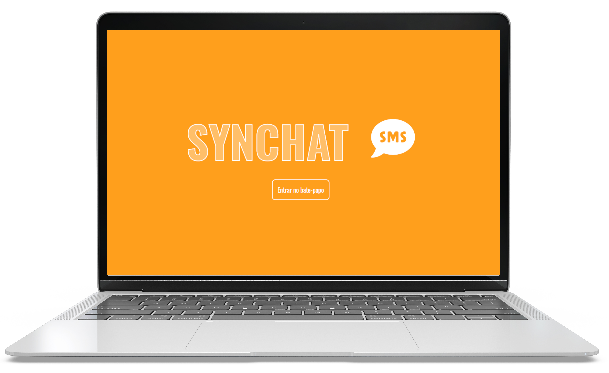
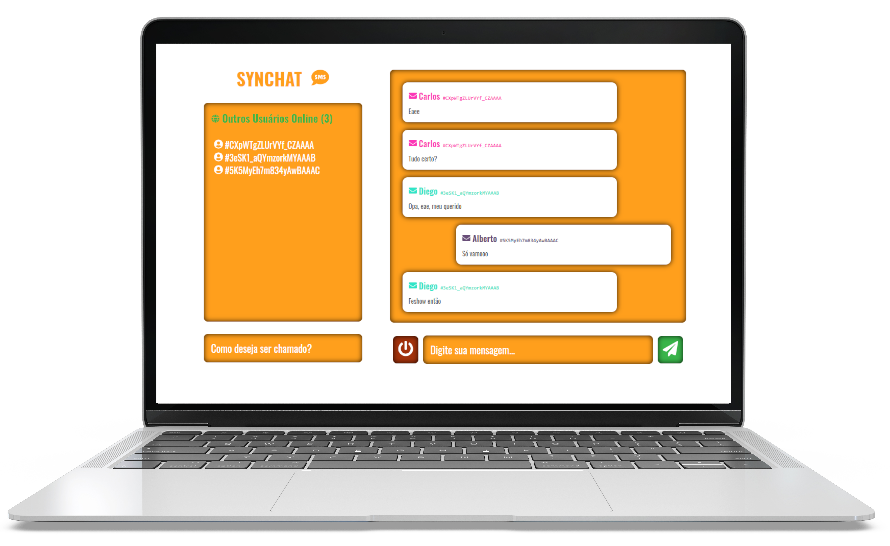
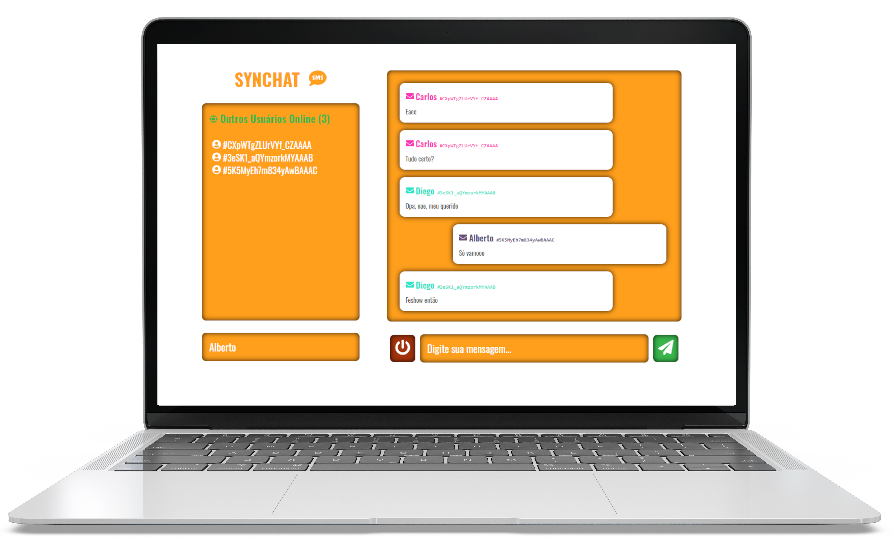

<!-- PROJECT LOGO -->
<p align="center">
  <a href="https://github.com/cristianprochnow/Synchat">
    
  </a>

  <p align="center">
    A simple and practical web chat.
    <br />
    <a href="https://github.com/cristianprochnow/Synchat"><strong>Explore the docs »</strong></a>
    <br />
    <br />
    <a href="https://github.com/cristianprochnow/Synchat/issues">Report Bug</a>
    ·
    <a href="https://github.com/cristianprochnow/Synchat/issues">Request Feature</a>
  </p>
</p>

<!-- PROJECT SHIELDS -->
<!--
*** I'm using markdown "reference style" links for readability.
*** Reference links are enclosed in brackets [ ] instead of parentheses ( ).
*** See the bottom of this document for the declaration of the reference variables
*** for contributors-url, forks-url, etc. This is an optional, concise syntax you may use.
*** https://www.markdownguide.org/basic-syntax/#reference-style-links
-->
<div align="center">

  [![Contributors][contributors-shield]][contributors-url]
  [![Forks][forks-shield]][forks-url]
  [![Stargazers][stars-shield]][stars-url]
  [![Issues][issues-shield]][issues-url]
  [![Repo Size][repo-size-shield]][repo-size-url]
  [![Code Size][code-size-shield]][code-size-url]
  [![MIT License][license-shield]][license-url]

</div>
<br />

<!-- TABLE OF CONTENTS -->
<h2>📚 Table of Contents</h2>

* [About the Project](#about-the-project)
  * [Built With](#built-with)
* [Getting Started](#getting-started)
  * [Prerequisites](#prerequisites)
  * [Installation](#installation)
* [Usage](#usage)
* [Contributing](#contributing)
* [License](#license)
* [Contact](#contact)

<br />

<!-- ABOUT THE PROJECT -->
<h2 id="about-the-project">📖 About The Project</h2>

<div align="center">
  <a href="./.github/notebook-home-screen.png">
    
  </a>
  <a href="./.github/notebook-chat-without-name.png">
    
  </a>
</div>

<br />

Since I started to programming with JavaScript, the real time interactions of this language impress me. And then, I met with a technology like `websocket.js`, that encouraged me to make this chat.

Here's why:
* Test functionalities like "real time"
* Apply some concepts about [React](https://github.com/facebook/react) technology


<h3 id="built-with">🔧 Built With</h3>

* [React](https://github.com/facebook/react)
* [Express](https://github.com/expressjs/express)
* [Socket.io](https://github.com/socketio/socket.io)

<br />

<!-- GETTING STARTED -->
<h2 id="getting-started">🚀 Getting Started</h2>

<h3 id="prerequisites">📝 Prerequisites</h3>

* [Node.js](https://nodejs.org/en/download/package-manager/)

<h3 id="installation">⚙️ Installation</h3>

1. Clone this repository

```sh
  git clone https://github.com/cristianprochnow/Synchat.git
```

2. Install all the packages and dependencies

```sh
  # If you are using NPM
  npm install

  # Or then, if you are using Yarn
  yarn
```

3. Enter in `backend` and then in `frontend` folders, and start the servers

```sh
  # If you are using NPM
  npm start

  # Or then, if you are using Yarn
  yarn start
```

4. A page in web will be available after the initialization of `frontend` server. If not, go to browser and search `http://localhost:3000`

<br />

<!-- USAGE EXAMPLES -->
<h2 id="usage">💡 Usage</h2>

It's simple. First, start typing the name that you wish in the `username field`. And then, enjoy the chat sending messages, typing several types of text in `message field`.

<div align="center">
  <a href="./.github/notebook-chat-with-name.png">
    
  </a>
</div>

<br />

> Open other tabs of browser with the same address (`http://localhost:3000`) to see chat in action


<br />

<!-- CONTRIBUTING -->
<h2 id="contributing">🔗 Contributing</h2>

Contributions are what make the open source community such an amazing place to be learn, inspire, and create. Any contributions you make are **greatly appreciated**.

1. 🍴 Fork the Project
2. 👯 Clone this project (`git clone https://github.com/cristianprochnow/BeTheHero.git`)
3. 🔀 Create your Feature Branch (`git checkout -b my-feature`)
4. ✔️ Commit your Changes (`git commit -m 'feat: My new feature'`)
5. 📌 Push to the Branch (`git push origin my-feature`)
6. 🔁 Open a Pull Request

<br />

<!-- LICENSE -->
<h2 id="license">📜 License</h2>

Distributed under the MIT License. See `LICENSE` for more information.

<br />

<!-- CONTACT -->
<h2 id="contact">📞 Contact</h2>

Cristian Prochnow - [![LinkedIn][linkedin-shield]][linkedin-url]

Project Link: [https://github.com/cristianprochnow/Synchat](https://github.com/cristianprochnow/Synchat)

<!-- MARKDOWN LINKS & IMAGES -->
<!-- https://www.markdownguide.org/basic-syntax/#reference-style-links -->
[contributors-shield]: https://img.shields.io/github/contributors/cristianprochnow/Synchat.svg?style=flat
[contributors-url]: https://github.com/cristianprochnow/Synchat/graphs/contributors
[forks-shield]: https://img.shields.io/github/forks/cristianprochnow/Synchat.svg?style=flat
[forks-url]: https://github.com/cristianprochnow/Synchat/network/members
[stars-shield]: https://img.shields.io/github/stars/cristianprochnow/Synchat.svg?style=flat
[stars-url]: https://github.com/cristianprochnow/Synchat/stargazers
[issues-shield]: https://img.shields.io/github/issues/cristianprochnow/Synchat.svg?style=flat
[issues-url]: https://github.com/cristianprochnow/Synchat/issues
[license-shield]: https://img.shields.io/github/license/cristianprochnow/Synchat.svg?style=flat
[license-url]: https://github.com/cristianprochnow/Synchat/blob/master/LICENSE.txt
[repo-size-shield]: https://img.shields.io/github/repo-size/cristianprochnow/Synchat.svg?style=flat
[repo-size-url]: https://github.com/cristianprochnow/Synchat
[code-size-shield]: https://img.shields.io/github/languages/code-size/cristianprochnow/Synchat
[code-size-url]: https://github.com/cristianprochnow/Synchat
[linkedin-shield]: https://img.shields.io/badge/-LinkedIn-black.svg?style=flat&logo=linkedin&colorB=0077b4
[linkedin-url]: https://www.linkedin.com/in/cristianprochnow
